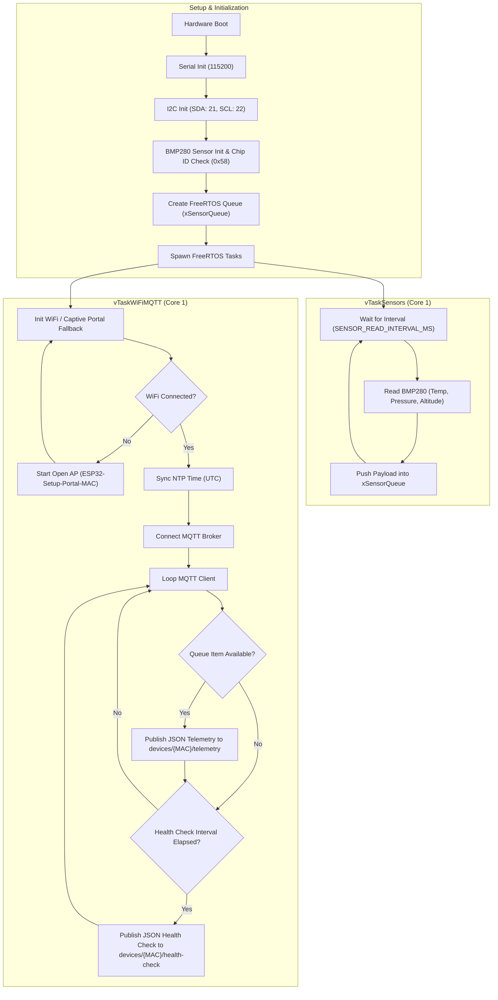

# ESP32 BMP280 MQTT Sensor Node Firmware

Production-ready, modular firmware for ESP32 nodes with BMP280 sensor integration, FreeRTOS multitasking, dynamic WiFi provision, and MQTT telemetry reporting.

---

## 📁 File Structure

```text
services/esp32-firmware/
├── platformio.ini             # PlatformIO config, library dependencies, build flags
├── secrets.ini                # Local secrets (WiFi, MQTT broker, topic base) - ignored by Git
├── secrets.ini.example        # Public template for local configuration
├── OTA_IMPLEMENTATION_GUIDE.md# Documentation for re-enabling OTA updates
├── include/
│   ├── config.h               # Centralized parameters, MQTT topics, timeouts & MAC helper
│   ├── wifi_manager.h         # WiFi connection manager & Captive Portal interface
│   ├── mqtt_client.h          # MQTT client interface for telemetry and health-check
│   └── sensor_stubs.h         # BMP280 sensor reader interface
└── src/
    ├── main.cpp               # FreeRTOS tasks orchestration & queue initialization
    ├── wifi_manager.cpp       # WiFi connection & Captive Portal fallback implementation
    ├── mqtt_client.cpp        # PubSubClient logic & JSON payload formatting
    └── sensor_stubs.cpp       # Real BMP280 I2C sensor reading implementation
```

---

## 🛠️ Build & Flash Instructions

### 1. Configure Local Secrets
Copy `secrets.ini.example` to `secrets.ini` and set your local WiFi and MQTT broker credentials:
```bash
cp secrets.ini.example secrets.ini
```

### 2. Build Firmware
```bash
cd services/esp32-firmware
pio run
```

### 3. Flash to ESP32
```bash
pio run --target upload
```

### 4. Monitor Serial Output
```bash
pio device monitor
```

---

## 🔄 Program Flowchart



---

## 📐 Architecture & Design Decisions

### 1. MQTT Topic Architecture

#### Hierarchical Topic Layout (Default Active Setup)
- **Telemetry Topic**: `${mqtt_topic_base}/{MAC}/telemetry` (e.g. `devices/{MAC}/telemetry`)
- **Health Check Topic**: `${mqtt_topic_base}/{MAC}/health-check` (e.g. `devices/{MAC}/health-check`)
- **Inbound Command Topic**: `${mqtt_topic_base}/{MAC}/commands` (e.g. `devices/{MAC}/commands`)
- **Broadcast Topic**: `${mqtt_topic_base}/broadcast` (e.g. `devices/broadcast`)

##### Key Reasons:
1. **Per-Node Filtering**: Isolates single-node traffic by subscribing directly to its MAC address without filtering full message streams.
2. **Wildcard Subscription**: Centralized systems subscribe to `${mqtt_topic_base}/+/telemetry` to receive data from all nodes.
3. **Broadcast Command Support**: Allows sending global commands (e.g. reboot) to all connected devices simultaneously.

---

### 2. Secrets Management & Build-Time Injection

- **`secrets.ini`**: Stores sensitive credentials (`wifi_ssid`, `wifi_pass`, `mqtt_host`, `mqtt_port`, `mqtt_user`, `mqtt_pass`, `mqtt_topic_base`). Excluded from Git (`.gitignore`).
- **`secrets.ini.example`**: Tracked in Git as a public template.
- **`platformio.ini`**: Uses `extra_configs = secrets.ini` and passes compiler flags (`-D DEFAULT_WIFI_SSID`, `-D MQTT_TOPIC_BASE`, etc.) at build time.
- **`include/config.h`**: Uses `#ifndef` directives so build flags take precedence while maintaining safe default fallbacks.

---

### 3. FreeRTOS Multitasking & Inter-Task Decoupling

- **Task 1 (`vTaskSensors` - Core 1)**: Reads BMP280 sensor data at fixed intervals (`SENSOR_READ_INTERVAL_MS`) and places `SensorPayload` structs into a FreeRTOS Queue (`xSensorQueue`).
- **Task 2 (`vTaskWiFiMQTT` - Core 1)**: Manages WiFi state, handles MQTT reconnection, pops payloads from `xSensorQueue`, and publishes telemetry and health-check messages.
- **Queue Decoupling**: Sensor sampling runs deterministically without blocking on network latency or MQTT reconnect delays.

---

### 4. Hardware Configuration & I2C Bus

- **Microcontroller**: ESP32 Dev Module.
- **Sensor**: Adafruit BMP280.
- **I2C Pin Mapping**:
  - `SDA`: GPIO 21
  - `SCL`: GPIO 22
- **Supported I2C Addresses**: Primary `0x76`, secondary `0x77`.
- **Diagnostics**: Verifies sensor presence by reading the Chip ID register (`0x58`).

---

### 5. Captive Portal & Network Fallback

- **Library**: `WiFiManager`.
- **Operation**: Attempts connection using saved credentials or pre-configured defaults. If connection fails within `WIFI_CONNECT_TIMEOUT` (15s), it starts an open AP named `ESP32-Setup-Portal-{MAC_SUFFIX}`.
- **Web Interface**: Users can connect without a password and navigate to `http://192.168.4.1` to configure local WiFi parameters.

---

### 6. UTC Time Synchronization

- **Protocol**: SNTP via `configTime(0, 0, "pool.ntp.org", "time.nist.gov")`.
- **Initialization**: Automatically triggered upon successful WiFi connection.
- **Timestamp Field**: Publishes standard Unix UTC epoch timestamps (seconds) in JSON payloads once clock sync is established.
